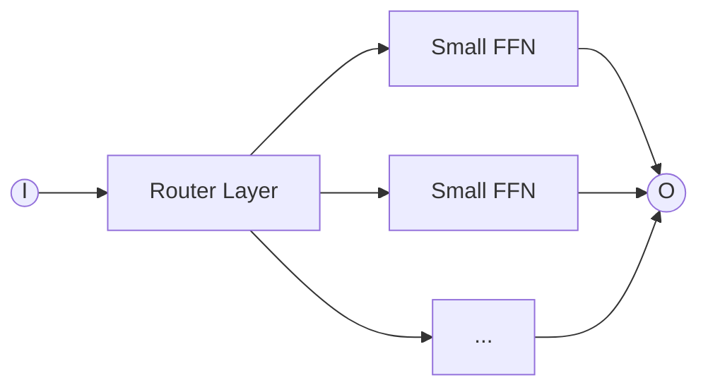
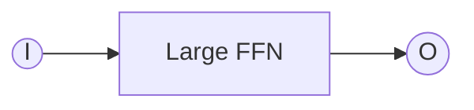

## Introduction to MoEs

### What is Mixture of Experts
Mixture of experts is an architecture that looks like this:

Instead of looking like this:

**Allows us to train a model with more parameters for the same training FLOPS, which people have shown leads to quicker loss reduction**.

### Why are they not the standard

* Infrastructure is complex. Experts provide natural parallelization; Sparsity is good when you have to data parallelism in training or high throughput inference. If not getting enough value out of sparsity, the infra overhead is a lot.
* Routing decisions are not differentiable, because we have to pick and commit to a particular expert. It can be via heuristics, or be unstable.

### Where do we use them?

In place of a of a Dense Feed Forward Layer (typically)
In place of an attention head (not common, possibly more unstable than even MLP MoE)

## Routing Function

### Major choices we have

We need to select some experts for each token. The sum of outputs of all the experts will be the result of our model.

* Token choice top-k ✅
	* Each token is gonna rank order experts by affinity, then select top-k
	* Almost all models have converged to this
	* Switch transformer (k=1), GShard (k=2), Grok(k=2), Mixtral (k=2), Qwen (k=4), DBRX (k-2) and DeepSeek (k=7)
* Expert choice top-k
	* Each expert chooses which tokens should be routed to it
	* This is balanced over experts
* Globally decided expert assignment
	* We can solve some complex optimization problem to match tokens to experts
	* Many ideas, learn by RL, solve optimal transport, cost of learning is prohibitive
* Random hash function based routing
	* Still gives gains
	* Used often as a baseline

### Details of the routing process

The assignment to experts is computed like attention, by a dot product between expert parameters (learned) $\vec{e}$ and input token vector $\vec{u}$ at layer $l$.
$$s_{i,t} = \text{Softmax}_i({\vec{u}_t^l}^T \vec{e}_i^l)$$
Now from this softmax, we select top-k. We cannot just keep the softmax output as gates to ensure inference efficiency (so that all experts don't have to be queried).
<small>In some architectures, we keep softmax after the top-k to normalize, but the normalization doesn't really matter.</small>
$$g_{i,t} = \begin{cases}s_{i,t}&\text{if }s_{i,t} \in Topk\big(\{s_{j,t}|1 \leq j \leq N\}, k\big)\\0, & \text{otherwise}\end{cases}$$
Instead of just taking top-k, it's also possible to soft-sample from the softmax. A google paper selects top element and samples second element based on residual values of softmax to promote more exploration. However, if only done at training time, it leads to a train-test mismatch.

Finally we use these gates on the expert outputs, and add back a residual connection.
$$h_t^l = \sum_{i=1}^{N}(g_{i,t} \text{ FFN}_i(\vec{u}_t^l) + \vec{u}_t^l)$$

The routing is this simple (just a dot product) because:
* Any more complex router must pay for it's own flops in gained efficiency, which most can't
* Gradients are only obtained by actually taking >1 expert and comparing, which is unstable